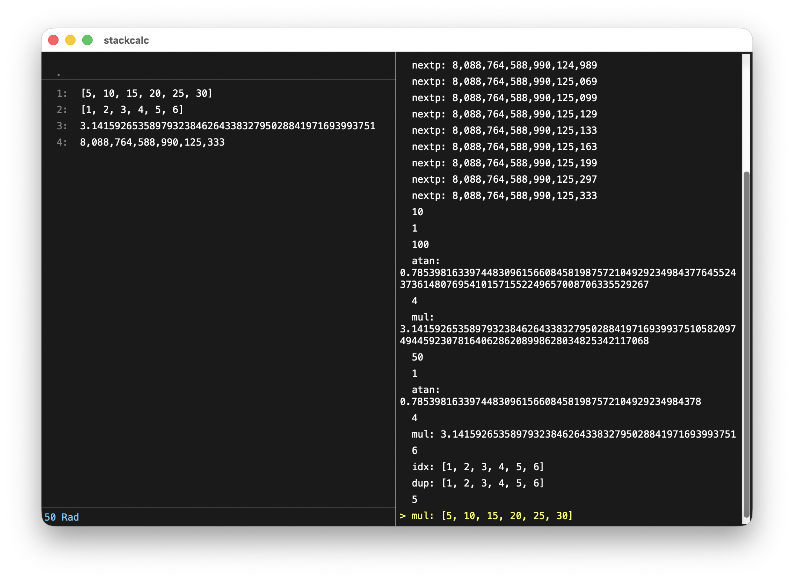

# stackcalc

A GUI calculator closely modeled after [Emacs `M-x calc`][orig].

## Build

On any system:

    $ cmake -B build
    $ cmake --build build

Dependencies are automatically downloaded.

## License

The calculator itself is in the public domain but depends on GMP (LGPL),
MPFR (LGPL), and wxWidgets (like LGPL).

[orig]: https://www.gnu.org/software/emacs/manual/html_mono/calc.html 
